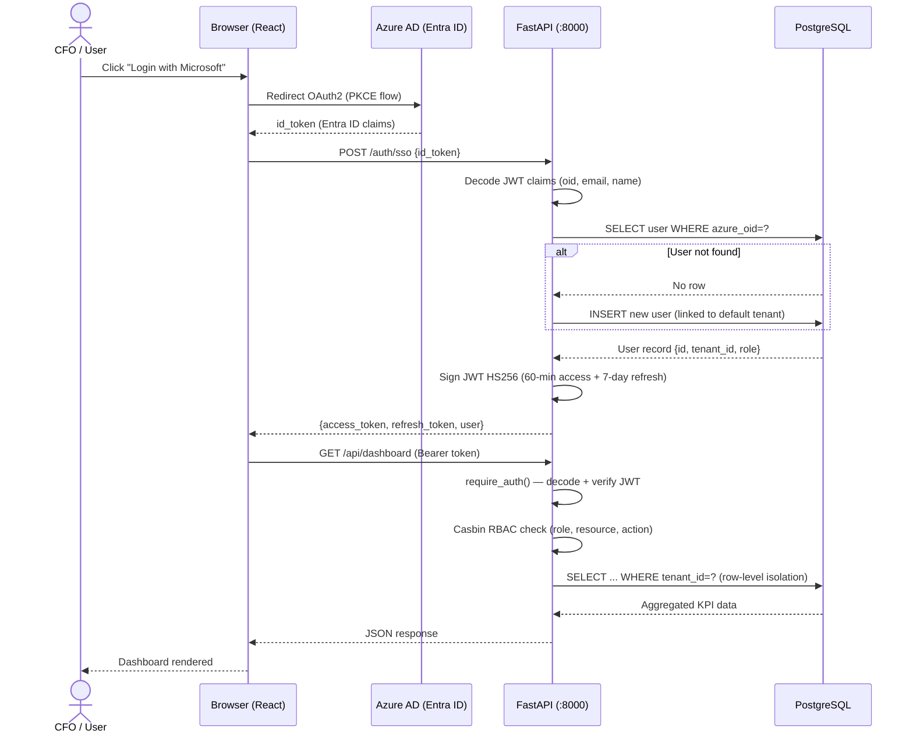
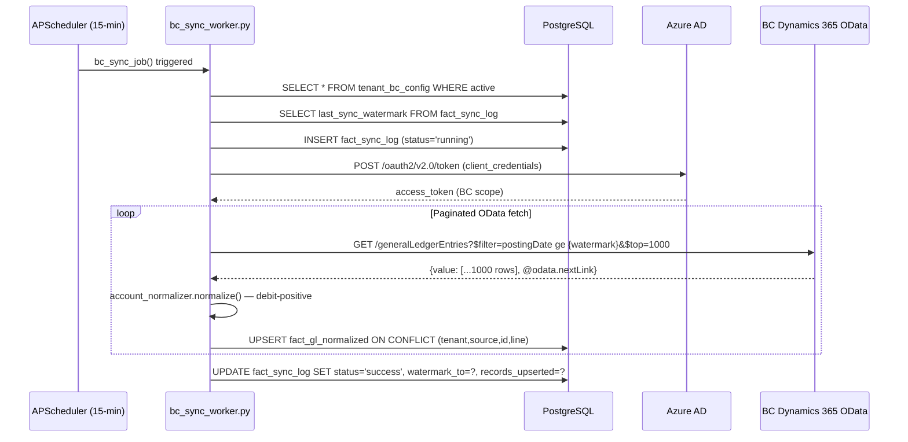
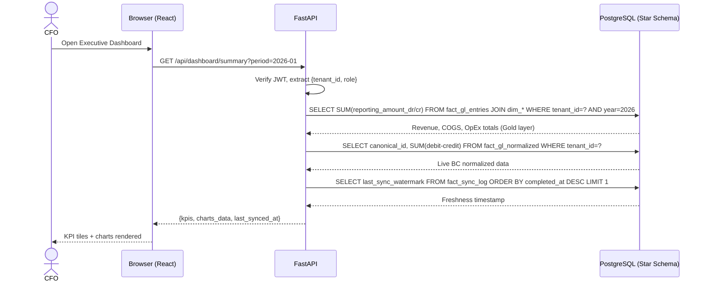
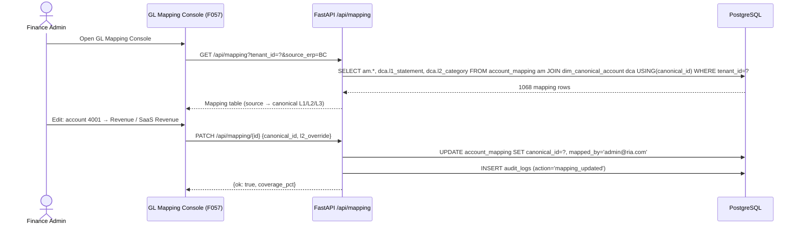

# i-finsights — Technical Architecture

**Version:** 1.0
**Stack:** React 18 + TypeScript → FastAPI → PostgreSQL
**Deployed:** https://i-finsights.netlify.app

---

## System Overview

```
┌─────────────────────────────────────────────────────────────────────┐
│  17 Business Central SaaS Tenants                                   │
│  BC001 · BC002 · BC003 ... BC017                                    │
│  Microsoft Dynamics 365 Business Central OData API v2.0             │
└────────────────────────┬────────────────────────────────────────────┘
                         │ Certificate-based OAuth
                         ▼
┌─────────────────────────────────────────────────────────────────────┐
│  FastAPI Backend  (03_Backend/)           http://localhost:8000      │
│                                                                     │
│  ┌─────────────┐  ┌─────────────┐  ┌─────────────┐                │
│  │ Auth Router  │  │Tenant Router│  │ ETL Scripts  │               │
│  │ /auth/*      │  │/api/tenants │  │ etl/         │               │
│  └─────────────┘  └─────────────┘  └──────┬───────┘               │
│  ┌─────────────┐  ┌─────────────┐         │                        │
│  │  Dashboard  │  │  Analytics  │  Bronze → Silver → Gold          │
│  │  /api/dash  │  │  /api/analy │         │                        │
│  └─────────────┘  └─────────────┘         │                        │
│  ┌─────────────┐  ┌─────────────┐         │                        │
│  │  GL Router  │  │ Reports     │         │                        │
│  │  /api/gl    │  │ /api/reports│         │                        │
│  └─────────────┘  └─────────────┘         │                        │
└────────────────────────────────────────────┼────────────────────────┘
                                             │
                    ┌────────────────────────▼────────────────────────┐
                    │  PostgreSQL Database                             │
                    │                                                 │
                    │  ┌─────────────┐   ┌──────────────────────┐   │
                    │  │  Raw Layer  │   │   Star Schema (Gold)  │   │
                    │  │ gl_unified  │   │  fact_gl_entries       │   │
                    │  │ 188K rows   │   │  fact_coa_balances     │   │
                    │  │ 17 entities │   │  fact_posted_sales     │   │
                    │  └─────────────┘   │  dim_* (12 dims)      │   │
                    │                    └──────────────────────┘   │
                    │  ┌─────────────────────────────────────────┐   │
                    │  │  Auth & Multi-Tenancy                   │   │
                    │  │  tenants · users · tenant_bc_config     │   │
                    │  └─────────────────────────────────────────┘   │
                    └─────────────────────────────────────────────────┘
                                             ▲
                                      REST API (JSON)
                                      Bearer JWT auth
                                             │
┌────────────────────────────────────────────┼────────────────────────┐
│  React Frontend  (02_Frontend/)            │   http://localhost:5173 │
│  Deployed to Netlify                       │                        │
│                                            │                        │
│  ┌─────────────────────────────────────────┴──────────────────┐    │
│  │  AuthContext  ·  TenantContext  ·  MSAL (Entra ID)         │    │
│  └─────────────────────────────────────────────────────────────┘    │
│                                                                     │
│  ┌──────────────┐  ┌──────────────┐  ┌───────────────────────┐   │
│  │  AppShell    │  │  Sidebar     │  │  ProtectedRoute        │   │
│  │  (Layout)    │  │  (Nav)       │  │  (Role Guards)         │   │
│  └──────────────┘  └──────────────┘  └───────────────────────┘   │
│                                                                     │
│  51 Pages: Landing · Login · Dashboard · GL Explorer · Reports...   │
└─────────────────────────────────────────────────────────────────────┘
```

---

## Frontend Architecture

### Technology
| Package | Version | Purpose |
|---------|---------|---------|
| React | 18.3.1 | UI framework |
| TypeScript | 5.5.3 | Type safety |
| Vite | 5.3.4 | Build tool + dev server |
| React Router | 6.26.0 | SPA routing |
| Recharts | 2.12.7 | Charts (bar, line, waterfall, heatmap) |
| @azure/msal-browser | 3.14.0 | Azure Entra ID SSO |
| @azure/msal-react | 2.0.22 | MSAL React integration |
| powerbi-client | 2.23.1 | Power BI report embed |
| Playwright | 1.59.1 | E2E testing |

### Directory Structure
```
02_Frontend/
├── src/
│   ├── App.tsx                    # Router + context providers
│   ├── main.tsx                   # React root mount
│   ├── index.css                  # Global design tokens + CSS
│   ├── api/
│   │   └── client.ts              # Axios/fetch API client
│   ├── assets/
│   │   ├── ria-advisory-logo.svg
│   │   ├── isource-logo.png
│   │   └── pattern-lattice.svg    # Design system hex pattern
│   ├── components/
│   │   ├── auth/
│   │   │   └── ProtectedRoute.tsx # Role-based route guard
│   │   ├── layout/
│   │   │   ├── AppShell.tsx       # Main layout (sidebar + topbar)
│   │   │   ├── AppShellBlank.tsx  # Blank layout (logo only)
│   │   │   └── Sidebar.tsx        # Navigation sidebar
│   │   └── shared/
│   │       ├── KPITile.tsx
│   │       ├── PowerBIEmbed.tsx
│   │       └── StatusBadge.tsx
│   ├── config/
│   │   └── msalConfig.ts          # Azure AD app registration config
│   ├── contexts/
│   │   ├── AuthContext.tsx         # User auth state, role, login/logout
│   │   └── TenantContext.tsx       # Active tenant, switchTenant()
│   ├── pages/                     # 52 page components (F000–F051)
│   └── types/
│       └── index.ts               # 80+ TypeScript types + UserRole
├── playwright.config.ts            # Playwright config (tests in 05_Tests/)
├── vite.config.ts
├── tsconfig.json
└── package.json
```

### Context Architecture
```typescript
// App.tsx wraps everything in order:
<MsalProvider instance={msalInstance}>
  <AuthProvider>          // login(), loginSSO(), user, isAuthenticated
    <TenantProvider>      // activeTenantId, switchTenant()
      <RouterProvider />  // 51 routes
    </TenantProvider>
  </AuthProvider>
</MsalProvider>
```

### Route Protection
```typescript
// ProtectedRoute enforces role hierarchy:
roleOrder: ['viewer', 'finance_user', 'isource_admin', 'ria_admin', 'superadmin']

// Usage:
<ProtectedRoute requiredRole="finance_user">  // finance_user and above
<ProtectedRoute requiredRole="ria_admin">      // ria_admin and above
<ProtectedRoute requiredRole="superadmin">     // superadmin only
```

---

## Backend Architecture

### Technology
| Package | Version | Purpose |
|---------|---------|---------|
| FastAPI | 0.111.0 | REST API framework |
| Uvicorn | 0.30.1 | ASGI web server |
| psycopg2-binary | 2.9.9 | PostgreSQL driver |
| python-jose | 3.3.0 | JWT token encoding/decoding |
| passlib[bcrypt] | 1.7.4 | Password hashing |
| httpx | 0.27.0 | BC OAuth token requests |
| pandas | 2.2.2 | ETL data manipulation |
| openpyxl | 3.1.5 | Excel-based ETL |
| python-dotenv | 1.0.1 | Environment variable loading |

### Directory Structure
```
03_Backend/
├── main.py                # FastAPI app + CORS + router registration
├── database.py            # PostgreSQL connection + query() helper
├── auth_utils.py          # JWT creation/verification + role dependencies
├── requirements.txt       # Python dependencies
├── routers/
│   ├── auth.py            # /auth/* endpoints
│   ├── tenants.py         # /api/tenants/* endpoints
│   ├── dashboard.py       # /api/dashboard/* endpoints
│   ├── entities.py        # /api/entities/* endpoints
│   ├── analytics.py       # /api/analytics/* endpoints
│   ├── gl.py              # /api/gl/* endpoints
│   ├── insights.py        # /api/insights/* endpoints
│   ├── reports.py         # /api/reports/* endpoints
│   └── settings.py        # /api/settings/* endpoints
├── migrations/
│   ├── 001_star_schema.sql           # Initial star schema
│   └── 002_roles_tenant_config.sql   # Multi-tenancy + BC config
└── etl/                   # ETL scripts for data loading
```

### Authentication Flow
```
1. User submits email + password → POST /auth/login
2. Server verifies bcrypt hash → returns {access_token, refresh_token, user}
3. Client stores tokens in localStorage
4. All API calls include: Authorization: Bearer <access_token>
5. FastAPI dependency require_auth() decodes JWT → injects {sub, tenant_id, role}
6. Role dependencies (require_ria_admin etc.) enforce RBAC per endpoint

SSO Flow:
1. MSAL completes Entra ID login → returns id_token
2. Client sends id_token → POST /auth/sso
3. Server decodes JWT claims (oid, email, name) — no sig verify in dev
4. Finds or creates user linked to default tenant
5. Returns same {access_token, refresh_token, user}
```

### Database Helper
```python
# database.py exposes single function:
def query(sql: str, params=None) -> list[dict]:
    # Opens connection, executes, returns list of dicts, closes connection
    # Used everywhere: query("SELECT ...", (param1, param2))
```

---

## Database Architecture

### Star Schema (Gold Layer)
```sql
-- Central fact table
fact_gl_entries (188,380 rows)
  ├── company_id    → dim_company (17 subsidiaries)
  ├── account_id    → dim_account (474 canonical accounts)
  ├── date_id       → dim_date   (282 calendar days)
  ├── currency_id   → dim_currency (8 currencies)
  ├── document_id   → dim_document (36 doc types)
  ├── posting_grp_id → dim_posting_group (19 groups)
  ├── dept_id       → dim_department (32 departments)
  ├── counterparty_id → dim_counterparty (967 customers/vendors)
  ├── bal_account_id → dim_bal_account (1,007)
  ├── project_id    → dim_project (44 projects)
  ├── project_code_id → dim_project_code (259 codes)
  └── geo_id        → dim_geo (3 regions)

fact_coa_balances (7,892 rows)
  ├── company_id → dim_company
  ├── account_id → dim_account
  └── date_id    → dim_date

fact_posted_sales (3,094 rows)
  ├── company_id     → dim_company
  ├── counterparty_id → dim_counterparty
  └── date_id        → dim_date
```

### Multi-Tenancy Tables
```sql
tenants (
  id UUID PK,
  name VARCHAR,
  slug VARCHAR UNIQUE,    -- 'ria-advisory', 'isource'
  plan VARCHAR,           -- trial/starter/professional/enterprise
  status VARCHAR,         -- active/suspended/deleted
  settings JSONB          -- {branding, subsidiary_access, billing}
)

users (
  id UUID PK,
  email VARCHAR UNIQUE,
  password_hash VARCHAR,
  display_name VARCHAR,
  role VARCHAR,           -- superadmin/ria_admin/isource_admin/finance_user/viewer
  tenant_id UUID → tenants,
  azure_oid VARCHAR,      -- Entra ID object ID for SSO
  is_active BOOLEAN,
  last_login TIMESTAMP
)

tenant_bc_config (
  id UUID PK,
  tenant_id UUID UNIQUE → tenants,
  bc_tenant_id VARCHAR,   -- Azure AD tenant for BC
  client_id VARCHAR,
  client_secret VARCHAR,  -- stored plaintext; encrypt in prod
  environment VARCHAR,    -- production/sandbox
  api_version VARCHAR,    -- v2.0
  auth_status VARCHAR,    -- pending/authenticated/error
  last_tested TIMESTAMP
)
```

---

## Data Pipeline Architecture

### Flow
```
17 BC Tenants (OData API)
       │
       ▼ (F001) Certificate OAuth → token per tenant
       │
       ▼ (F002) Data Extraction: GL Entries, CoA, Customers, Posted Sales
       │
       ▼ BRONZE (gl_unified): Raw append-only store
       │
       ▼ (F006) SILVER: Type cast, deduplicate, map accounts, standardise dates
       │
       ▼ (F007) CoA Mapping: subsidiary account → canonical account
       │
       ▼ (F010) IC Elimination: remove intercompany pairs
       │
       ▼ (F011) FX Translation: all amounts → USD
       │
       ▼ (F012) DQ Gates: completeness, referential integrity, range checks
       │
       ▼ GOLD (fact_gl_entries + star schema): Analytics-ready
       │
       ▼ FastAPI → React Dashboard
```

### ETL Scripts
- `03_Backend/etl/` contains Python scripts for each pipeline stage
- Triggered manually or via scheduler
- Each run logged to pipeline health endpoint

---

## Security Architecture

### Authentication
- **SSO:** Azure Entra ID (MSAL) — no passwords stored for SSO users
- **Local:** bcrypt password hashing (cost factor 12)
- **Tokens:** JWT (HS256, 60-min access + 7-day refresh)
- **Secret:** `JWT_SECRET` env var (must be rotated in prod)

### Authorisation (RBAC)
```python
# FastAPI dependency injection:
require_superadmin    = require_role("superadmin")
require_ria_admin     = require_role("superadmin", "ria_admin")
require_isource_admin = require_role("superadmin", "isource_admin")
require_any_admin     = require_role("superadmin", "ria_admin", "isource_admin")
require_finance_user  = require_role("superadmin", "ria_admin", "isource_admin", "finance_user")
```

### Tenant Isolation
- Every user has `tenant_id` in JWT claims
- All queries filter by `tenant_id`
- `_assert_tenant_access()` enforces cross-tenant access control
- Superadmin can switch tenant context via Tenant Hub

### CORS
- Configured in `main.py` — restrict to production origin in deployment

### BC Credentials
- `client_secret` stored in `tenant_bc_config` table
- **Production requirement:** Encrypt at rest using Azure Key Vault or similar

---

## Deployment

### Frontend — Netlify
```toml
# netlify.toml
[build]
  base    = "02_Frontend"
  command = "npm run build"
  publish = "dist"

[[redirects]]
  from   = "/*"
  to     = "/index.html"
  status = 200
```

**URL:** https://i-finsights.netlify.app

### Backend — Local / Cloud
```bash
cd 03_Backend
uvicorn main:app --reload --port 8000
```

**Target cloud:** Azure Container Apps or Azure App Service

### Environment Variables
```bash
# Backend (.env)
PGHOST=...
PGPORT=5432
PGDATABASE=ria_advisory
PGUSER=...
PGPASSWORD=...
JWT_SECRET=change-me-in-production
JWT_ALGORITHM=HS256
JWT_EXPIRE_MINUTES=60
JWT_REFRESH_DAYS=7

# Frontend (.env.local)
VITE_API_URL=http://127.0.0.1:8000
```

---

## Testing

### E2E Tests — Playwright (05_Tests/)
```
05_Tests/
├── playwright.config.ts     # Test runner config (baseURL: 5173)
├── package.json
├── smoke.spec.ts            # Landing page, login tabs, redirect
├── login_flow.spec.ts       # Superadmin → hub, tenant entry, ria_admin login, logout
├── roles.spec.ts            # Role badges, tenant config 4 tabs, logo assertions
├── ria.spec.ts              # Backend API health, GL Explorer, Analytics
└── screenshots/             # Auto-captured test screenshots
```

**Run:**
```bash
cd 05_Tests
npm install
npx playwright install
npx playwright test --headed
```

**Test coverage:** 20 tests across 4 spec files covering auth flows, role system, reports, and API health.

---

## Performance Targets

| Metric | Target |
|--------|--------|
| Dashboard P95 load | < 2.5 seconds |
| GL Explorer search (188K rows) | < 2 seconds |
| API availability (business hours) | 99.9% |
| Playwright test suite runtime | < 5 minutes |

---

## Key Design Decisions

| Decision | Choice | Rationale |
|----------|--------|-----------|
| Frontend framework | React + TypeScript | Team familiarity, ecosystem maturity, Netlify deploy |
| API framework | FastAPI | Python, async, auto-docs, type validation |
| Database | PostgreSQL | ACID, JSON support, OLAP-capable at this data size |
| Data model | Star schema | Fast aggregations, dim reusability, analytics-ready |
| Auth | JWT + MSAL | Stateless API, enterprise SSO out of box |
| Multi-tenancy | Row-level (tenant_id FK) | Simple, auditable, no DB-per-tenant overhead |
| BC integration | OData v2.0 + OAuth | Microsoft's supported API; certificate-based = no passwords |
| Charts | Recharts | React-native, customisable, no licensing cost |
| Deployment | Netlify + BYOB backend | Zero frontend ops; backend scales independently |

---

## Update 2026-05-06

**Updated by:** Meera_Architect_002
**Tickets:** IC-38, IC-39, IC-40, IC-41, IC-42
**Status:** Active

### IC-38 — Brand Identity: i-CFO360 SVG Logo System

Platform rebranded from **i-finsights → i-CFO360**. New SVG logo assets added to `02_Frontend/src/assets/`:

| File | Purpose |
|------|---------|
| `icfo360-mark.svg` | Primary brand mark (square logomark) |
| `ifinsights-logo.svg` | Updated wordmark (full logo with tagline) |

Logo renders in Sidebar header and AppShellBlank (login/landing). All references to "i-finsights" in UI headings replaced with "i-CFO360".

---

### IC-39 — Deployment Migration: Netlify Removed → Self-Hosted VM

Netlify deployment retired. Target deployment: **self-hosted VM** via Docker Compose.

- `netlify.toml` retained in repo but no longer active
- `docker-compose.prod.yml` **pending creation** (Neha_DevOps_006 backlog)
- CORS configuration updated: `main.py` now reads allowed origins from `ALLOWED_ORIGINS` env var (comma-separated list) instead of hardcoded Netlify URL
- Dev server: frontend remains at `http://localhost:4002` (Vite port updated from 5173)
- Backend: `http://localhost:8000` (unchanged)

**Updated env vars:**
```
ALLOWED_ORIGINS=http://localhost:4002,https://your-vm-domain.com
```

**Deployment target state:**
```
VM (Ubuntu 22.04 LTS)
  ├── docker-compose.prod.yml  ← PENDING IC-39
  │     ├── ria-frontend   (nginx serving Vite build, port 80/443)
  │     └── ria-backend    (uvicorn, port 8000)
  └── PostgreSQL (managed or local container)
```

---

### IC-40 — BC Scheduled Sync Worker (APScheduler)

**New component:** `03_Backend/workers/bc_sync_worker.py`

Architecture:

```
APScheduler BackgroundScheduler
  └── bc_sync_job() — runs every 15 minutes
        ├── Reads tenant_bc_config for all active tenants
        ├── Calls bc_connector.fetch_gl_entries(from_watermark)
        │     └── BC Dynamics 365 OData API v2.0 (incremental)
        ├── Normalizes entries via account_normalizer.py
        ├── Upserts to fact_gl_normalized (natural key dedup)
        └── Writes sync result to fact_sync_log
```

**Watermark pattern:** each sync reads `last_sync_watermark` from `fact_sync_log` → fetches only new/changed entries since that timestamp → full-refresh fallback if no prior watermark exists.

**Scheduler lifecycle:** integrated into FastAPI lifespan context manager in `main.py`:
```python
@asynccontextmanager
async def lifespan(app):
    scheduler.start()          # startup
    yield
    scheduler.shutdown()       # graceful shutdown
```

**Landing zone:** `fact_gl_normalized` — normalized GL entries from BC sync worker, pre-mapped to canonical CoA. Distinct from `fact_gl_entries` (star schema gold layer populated by manual ETL pipeline).

---

### Migration 008 — fact_sync_log Schema Extension

File: `03_Backend/migrations/008_sync_worker.sql`

Extended `fact_sync_log` with:

| Column | Type | Purpose |
|--------|------|---------|
| `worker_run_id` | UUID | Unique ID per scheduler invocation |
| `records_fetched` | INTEGER | Raw count from OData API |
| `records_upserted` | INTEGER | Count written to fact_gl_normalized |
| `last_sync_watermark` | TIMESTAMP | Cursor for next incremental fetch |
| `error_detail` | TEXT | Error message if sync failed |
| `sync_duration_ms` | INTEGER | Wall-clock time for the sync run |

Table remains **append-only** (Rule 05 / Rule 06 immutable tables). No DELETE/UPDATE except `status` finalization.

---

### IC-41 — Health Score Methodology Modal

**Modified:** `02_Frontend/src/pages/42_F042_HealthScore.tsx`

Added an interactive methodology modal explaining the Health Score calculation:
- Modal triggered by "How is this calculated?" info button in page header
- Explains 6 sub-score components: Liquidity, Profitability, Leverage, Efficiency, Cash Flow, Growth
- Each component shows weight (%) and data sources used
- Modal is accessible: focus-trapped, ESC to close, `aria-modal` and `role="dialog"`

---

### IC-42 — Framer Motion Animations: 360° View

**Modified:** `02_Frontend/src/pages/54_F054_360View.tsx`

Framer Motion (`motion.div`) animations added to the 360° Financial View:
- Page-level mount animation: fade-in + slide-up (0.4s ease-out)
- KPI tile stagger: each tile enters with 80ms delay offset
- Chart area: scale-in on mount (0.95 → 1.0)
- Dependency added: `framer-motion` (already in package.json from IC-42)

---

### Freshness Service SQL Fix

**Modified:** `03_Backend/services/freshness_service.py`

Removed invalid `tenant_id` JOIN condition from `DataFreshnessService.get_freshness()` query. The `fact_sync_log` table records are keyed by `erp_source_id` not `tenant_id` directly; the fix queries via `dim_erp_source` for correct tenant scoping.

**Impact:** FreshnessIndicator component on all dashboard pages now loads without 500 error when `tenant_id` not present on `fact_sync_log` rows.

---

### ER Diagram Added

Full entity-relationship diagram: `00_docs/07_ER_Diagram.md`

Covers all 41 tables across 7 domains:
1. Auth & Tenancy
2. ERP Integration & Sync
3. Star Schema GL
4. Canonical CoA
5. Planning (Budgets & Investments)
6. Account Groups
7. RBAC (Casbin)

---

### Updated System Overview (2026-05-06)

```
┌──────────────────────────────────────────────────────────────────────┐
│  External Systems                                                     │
│  ┌────────────────────────┐   ┌────────────────────────────────────┐ │
│  │  BC Dynamics 365 OData │   │  Azure AD (Entra ID)               │ │
│  │  v2.0 API              │   │  OAuth2 / MSAL SSO                 │ │
│  └──────────┬─────────────┘   └──────────────────┬─────────────────┘ │
└─────────────┼──────────────────────────────────────┼─────────────────┘
              │ 15-min OData pull                    │ Token validation
              ▼                                      ▼
┌─────────────────────────────────────────────────────────────────────┐
│  FastAPI Backend  (03_Backend/)        http://localhost:8000         │
│                                                                     │
│  ┌──────────────────────┐  ┌──────────────────────────────────────┐ │
│  │  Auth & RBAC         │  │  BC Sync Worker                      │ │
│  │  JWT + Casbin        │  │  APScheduler (15-min)                │ │
│  │  5 role levels       │  │  bc_sync_worker.py                   │ │
│  └──────────────────────┘  └──────────────────────────────────────┘ │
│                                                                     │
│  20+ API Routers:                                                   │
│  /auth  /tenants  /dashboard  /analytics  /gl  /reports             │
│  /rbac  /canonical  /mapping  /freshness  /consolidated             │
│  /cross_erp  /erp_sources  /budgets  /investments  /account_groups  │
│                                                                     │
│  Services: freshness_service · consolidated_dashboard               │
│            cross_erp_pl · health_monitor · currency · vault         │
│  Connectors: bc_connector · odoo_connector · sap_connector          │
└────────────────────────────────────────────────────────────────────┘
                              │
                    psycopg2 (parameterized queries)
                              ▼
┌─────────────────────────────────────────────────────────────────────┐
│  PostgreSQL: ria_advisory  (41 tables, 7 domains)                   │
│                                                                     │
│  ┌─────────────┐  ┌─────────────────────────┐  ┌────────────────┐  │
│  │  Auth/RBAC  │  │  ERP Integration        │  │  Star Schema   │  │
│  │  tenants    │  │  dim_erp_source          │  │  fact_gl_entries│  │
│  │  users      │  │  tenant_bc_config        │  │  fact_gl_norm. │  │
│  │  casbin_rule│  │  fact_sync_log (008)     │  │  5 dim tables  │  │
│  └─────────────┘  └─────────────────────────┘  └────────────────┘  │
│                                                                     │
│  ┌─────────────────────────┐  ┌─────────────────────────────────┐  │
│  │  Canonical CoA          │  │  Planning                       │  │
│  │  dim_canonical_account  │  │  budgets · investments          │  │
│  │  account_mapping (1068) │  │  account_groups                 │  │
│  └─────────────────────────┘  └─────────────────────────────────┘  │
└─────────────────────────────────────────────────────────────────────┘
                              ▲
                    REST API  │  Bearer JWT
                              │
┌─────────────────────────────────────────────────────────────────────┐
│  React Frontend  (02_Frontend/)        http://localhost:4002         │
│  Brand: i-CFO360  |  Assets: icfo360-mark.svg, ifinsights-logo.svg  │
│                                                                     │
│  61 page files (F000–F061):                                         │
│  Dashboards · Reports · Admin · ERP Integration · Analytics         │
│                                                                     │
│  Components: FreshnessIndicator · ERPSourceBadge · KPITile          │
│              HealthScore Modal · Framer Motion 360° View            │
│  Contexts:   AuthContext · TenantContext · MSAL                     │
└─────────────────────────────────────────────────────────────────────┘
```

---

### Updated Page Inventory (2026-05-06)

Total: **61 page files** (F000–F061, some gaps are feature-roadmap placeholders)

| Range | Group | Count |
|-------|-------|-------|
| F000–F013 | Pipeline / ETL Visualization | 14 |
| F014 | Login | 1 |
| F015–F019 | Executive & Explorer | 5 |
| F020–F046 | Financial Reports & Analytics | 27 |
| F049–F054 | Admin, Tenants, 360° View | 6 |
| F055–F061 | ERP Integration & RBAC | 7 (F059 gap) |

---

### Updated Router Inventory (2026-05-06)

Total: **21 routers** in `03_Backend/routers/`

`auth` · `tenants` · `dashboard` · `analytics` · `gl` · `reports` · `insights` ·
`entities` · `settings` · `canonical` · `mapping` · `rbac` · `freshness` ·
`consolidated` · `cross_erp` · `erp_sources` · `budgets` · `investments` ·
`account_groups` · `cross_erp` (merged)

---

### Updated Migration Sequence (2026-05-06)

| # | File | Covers |
|---|------|--------|
| 001 | auth_tenant.sql | Initial tenants + users schema |
| 002 | roles_tenant_config.sql | Roles, tenant_bc_config |
| 003 | budgets_investments.sql | Budgets + investments tables |
| 004 | account_groups.sql | Account group hierarchy |
| 005 | casbin_rbac.sql | Casbin rule table for RBAC |
| 006 | company_tenant.sql | Company ↔ tenant FK mapping |
| 007 | canonical_model.sql | dim_canonical_account + account_mapping |
| 008 | sync_worker.sql | Extended fact_sync_log (IC-40) |

---

## Update 2026-05-06 — UML Diagrams + AWS Deployment Architecture

**Updated by:** Meera_Architect_002
**Scope:** UML sequence diagrams for key flows + AWS reference deployment architecture

### BC Connection Error Diagnostics (settings.py)

Improved `POST /api/settings/bc/test` error handling:
- Detects Azure AD error codes: AADSTS7000222 (expired secret), AADSTS7000215 (invalid secret), AADSTS65001 (no consent), AADSTS700016 (app not found)
- BC 401: now includes actionable checklist (BC API permission, env name, admin consent)
- BC 404: flags incorrect environment name
- BC 403: flags missing BC-level permission

---

### UML Sequence Diagrams

#### 1. Authentication Flow (SSO + JWT)



#### 2. BC Sync Worker Flow (15-min Incremental)



#### 3. GL Dashboard Query Flow (Star Schema)



#### 4. Canonical CoA Mapping Flow



---

### AWS Deployment Architecture (Reference)

Current deployment: Self-hosted Ubuntu VM (IC-39 — docker-compose.prod.yml pending).
Target AWS reference architecture:

```
┌─────────────────── AWS Region (ap-south-1 / me-south-1) ──────────────────────┐
│                                                                                  │
│  ┌─── VPC: 10.0.0.0/16 ───────────────────────────────────────────────────┐   │
│  │                                                                          │   │
│  │  ┌── Public Subnet (10.0.1.0/24) ─────────────────────────────────┐    │   │
│  │  │  AWS WAF (OWASP rules + rate limiting)                          │    │   │
│  │  │  Application Load Balancer (HTTPS :443 · SSL via ACM)          │    │   │
│  │  │  Routes: / → frontend · /api/* → backend                       │    │   │
│  │  └────────────────────────────────────────────────────────────────┘    │   │
│  │                              ↓                                          │   │
│  │  ┌── Private App Subnet (10.0.2.0/24 · Multi-AZ) ────────────────┐    │   │
│  │  │  Amazon ECS Fargate (auto-scaling, CPU 70% threshold)          │    │   │
│  │  │  ├── ria-frontend  (nginx:alpine · Vite build · Port :80)      │    │   │
│  │  │  └── ria-backend   (python:3.12 · FastAPI · Port :8000)        │    │   │
│  │  │       └── APScheduler embedded (BC sync every 15-min)          │    │   │
│  │  └────────────────────────────────────────────────────────────────┘    │   │
│  │                              ↓                                          │   │
│  │  ┌── Private DB Subnet (10.0.3.0/24 · Multi-AZ) ─────────────────┐    │   │
│  │  │  Amazon RDS PostgreSQL 16 (db.t3.medium)                       │    │   │
│  │  │  ria_advisory DB · 41 tables · Encrypted at rest (AES-256)     │    │   │
│  │  │  Automated snapshots · 7-day PITR · Port 5432 (app subnet only)│    │   │
│  │  └────────────────────────────────────────────────────────────────┘    │   │
│  └──────────────────────────────────────────────────────────────────────┘   │
│                                                                                  │
│  Supporting Services:                                                            │
│  ├── Secrets Manager: BC client_secret · JWT_SECRET · DB credentials           │
│  ├── ECR: ria-frontend:{sha} · ria-backend:{sha} (never :latest in prod)       │
│  ├── CloudWatch: access logs · BC sync metrics · ECS container insights         │
│  └── S3: RDS snapshot exports · ETL input files                                │
│                                                                                  │
└─────────────────────────────────────────────────────────────────────────────────┘

External (Internet-bound egress from App Subnet):
  ├── Azure AD (login.microsoftonline.com) — MSAL SSO + BC OAuth2 token
  └── BC Dynamics 365 (api.businesscentral.dynamics.com) — OData v2.0 pull
```

**Key migration items (self-hosted → AWS):**
1. Move `bc.client_secret` from `app_settings` table → AWS Secrets Manager
2. Replace docker-compose → ECS task definitions
3. Replace local PostgreSQL → Amazon RDS (Multi-AZ)
4. Add ALB + WAF in front of both containers
5. CloudWatch log groups for FastAPI + bc_sync_worker
