# 07 — Entity Relationship Diagram
**Status:** Active — Living Document
**Owner:** Kiran_Data_008
**Last Updated:** 2026-05-05
**Source:** ria_advisory PostgreSQL database (live schema query)

---

## Overview

41 tables organised into 7 domains. Core star schema centred on `fact_gl_entries` with 10 dimension tables. Multi-tenant isolation via `tenant_id UUID` on all client-data tables. 49 FK constraints. 106 indexes (including partial index on natural deduplication key for GL entries).

---

## Domain Groups

### Domain 1: Auth & Multi-Tenancy
Tables: `tenants`, `users`, `casbin_rule`, `impersonation_audit`, `audit_logs`, `app_settings`

### Domain 2: ERP Integration
Tables: `dim_erp_source`, `dim_erp_credential`, `dim_erp_mapping`, `tenant_bc_config`, `fact_sync_log`, `fact_connector_health_log`, `fact_connector_alerts`

### Domain 3: Financial Data — Star Schema
Tables: `fact_gl_entries`, `fact_posted_sales`, `fact_coa_balances`, `dim_account`, `dim_bal_account`, `dim_company`, `dim_date`, `dim_document`, `dim_department`, `dim_currency`, `dim_counterparty`, `dim_posting_group`, `dim_project`, `dim_project_code`, `dim_geo`, `dim_customer`

### Domain 4: Canonical CoA Model
Tables: `dim_canonical_account`, `account_mapping`, `fact_gl_normalized`, `fact_gl_quarantine`

### Domain 5: Planning & Portfolio
Tables: `budgets`, `investments`

### Domain 6: Configuration & RBAC
Tables: `account_groups`, `account_group_members`, `dim_dimension_hierarchy`, `dim_exchange_rate`

### Domain 7: System
Tables: `schema_migrations`

---

## Mermaid ER Diagram

```mermaid
erDiagram
    %% ==================== DOMAIN 1: AUTH & MULTI-TENANCY ====================

    tenants {
        uuid id PK
        varchar name
        varchar slug
        varchar plan
        varchar status
        jsonb settings
        timestamp created_at
    }

    users {
        uuid id PK
        varchar email
        varchar password_hash
        varchar display_name
        varchar azure_oid
        uuid tenant_id FK
        varchar role
        boolean is_active
        jsonb subsidiary_access
        timestamp created_at
        timestamp last_login
    }

    casbin_rule {
        int id PK
        varchar ptype
        varchar v0
        varchar v1
        varchar v2
        varchar v3
        varchar v4
        varchar v5
    }

    impersonation_audit {
        uuid id PK
        uuid admin_id FK
        uuid target_user_id FK
        uuid tenant_id FK
        timestamp started_at
        timestamp stopped_at
        text reason
        varchar ip_address
    }

    audit_logs {
        int id PK
        uuid tenant_id FK
        uuid user_id FK
        varchar action
        varchar resource
        jsonb details
        varchar ip_address
        timestamp created_at
    }

    app_settings {
        varchar key PK
        text value
        timestamp updated_at
    }

    %% ==================== DOMAIN 2: ERP INTEGRATION ====================

    dim_erp_source {
        int erp_source_id PK
        uuid tenant_id FK
        varchar erp_type
        varchar erp_version
        uuid entity_id
        varchar display_name
        varchar connection_status
        timestamp last_heartbeat_at
        timestamp last_synced_at
        jsonb sync_cursor
        jsonb schedule_config
        jsonb config_json
        int staleness_threshold_hours
        jsonb locked_periods
        timestamp created_at
        timestamp updated_at
    }

    dim_erp_credential {
        uuid credential_id PK
        int erp_source_id FK
        varchar credential_type
        varchar vault_secret_ref
        timestamp expires_at
        timestamp last_rotated_at
        varchar created_by
        timestamp created_at
    }

    dim_erp_mapping {
        int mapping_id PK
        int erp_source_id FK
        varchar source_account_code
        varchar source_account_name
        varchar canonical_account_no
        varchar canonical_category
        varchar canonical_l1
        varchar canonical_l2
        varchar canonical_l3
        varchar dimension_type
        varchar source_dimension_code
        varchar canonical_dimension_value
        numeric mapping_confidence
        varchar mapped_by
        timestamp mapped_at
        boolean is_active
    }

    tenant_bc_config {
        uuid id PK
        uuid tenant_id FK
        varchar bc_tenant_id
        varchar client_id
        varchar environment
        varchar api_version
        varchar auth_status
        timestamp last_tested
        timestamp updated_at
    }

    fact_sync_log {
        uuid sync_id PK
        int erp_source_id FK
        varchar sync_type
        varchar triggered_by
        date period_from
        date period_to
        timestamp started_at
        timestamp completed_at
        varchar status
        bigint records_fetched
        bigint records_inserted
        bigint records_updated
        bigint records_rejected
        text error_message
        jsonb cursor_before
        jsonb cursor_after
        int rows_fetched
        int rows_upserted
        timestamp watermark_from
        timestamp watermark_to
    }

    fact_connector_health_log {
        int log_id PK
        int erp_source_id FK
        timestamp checked_at
        varchar status
        int latency_ms
        text error_msg
    }

    fact_connector_alerts {
        uuid alert_id PK
        int erp_source_id FK
        uuid tenant_id
        varchar alert_type
        varchar severity
        jsonb details
        boolean is_read
        timestamp created_at
    }

    %% ==================== DOMAIN 3: FINANCIAL DATA - STAR SCHEMA ====================

    fact_gl_entries {
        int entry_no PK
        smallint company_id PK
        varchar account_no FK
        int date_id FK
        smallint document_id FK
        smallint posting_group_id FK
        smallint department_id FK
        int counterparty_id FK
        int bal_account_id FK
        int project_id FK
        int project_code_id FK
        smallint geo_id FK
        smallint currency_id FK
        int erp_source_id FK
        numeric amount
        varchar document_no
        text description
        varchar erp_native_journal_id
        varchar erp_native_line_number
        char transaction_currency
        numeric transaction_amount_dr
        numeric transaction_amount_cr
        char functional_currency
        numeric functional_amount_dr
        numeric functional_amount_cr
        numeric reporting_amount_dr
        numeric reporting_amount_cr
        numeric exchange_rate_used
        boolean is_intercompany
        boolean is_elimination_entry
        boolean is_final
        numeric data_quality_score
    }

    fact_posted_sales {
        int entry_no PK
        smallint company_id PK
        varchar account_no FK
        int date_id FK
        smallint document_id FK
        smallint posting_group_id FK
        smallint department_id FK
        int counterparty_id FK
        smallint currency_id FK
        numeric amount
        varchar customer_vendor_name
        varchar gl_account_name
        int dimension_set_id
    }

    fact_coa_balances {
        smallint company_id PK
        varchar account_no PK
        numeric net_change
        numeric balance
    }

    dim_account {
        varchar account_no PK
        varchar account_name
        varchar income_balance
        varchar account_category
        varchar account_subcategory
        varchar account_type
        varchar totaling
    }

    dim_bal_account {
        int bal_account_id PK
        varchar bal_account_type
        varchar bal_account_no
    }

    dim_company {
        smallint company_id PK
        varchar company_name
        smallint currency_id FK
        uuid tenant_id
    }

    dim_date {
        int date_id PK
        date full_date
        smallint year
        smallint quarter
        varchar quarter_name
        smallint month
        varchar month_name
        smallint week
        smallint day
        varchar day_name
        smallint is_month_end
        smallint fiscal_year
        smallint fiscal_quarter
        varchar fiscal_period
    }

    dim_document {
        smallint document_id PK
        varchar document_type
        varchar source_code
    }

    dim_department {
        smallint department_id PK
        varchar department_code
        varchar vertical_code
    }

    dim_currency {
        smallint currency_id PK
        varchar currency_code
        varchar currency_name
        varchar currency_symbol
    }

    dim_counterparty {
        int counterparty_id PK
        varchar source_type
        varchar source_no
    }

    dim_posting_group {
        smallint posting_group_id PK
        varchar gen_posting_type
        varchar gen_bus_posting_group
        varchar gen_prod_posting_group
    }

    dim_project {
        int project_id PK
        varchar project_no
    }

    dim_project_code {
        int project_code_id PK
        varchar project_code
    }

    dim_geo {
        smallint geo_id PK
        varchar geo_code
    }

    dim_customer {
        int customer_id PK
        int counterparty_id FK
        varchar customer_no
        varchar customer_name
        varchar company
        varchar city
        numeric balance
        numeric balance_due
        numeric total_sales
        numeric total_payments
    }

    %% ==================== DOMAIN 4: CANONICAL COA MODEL ====================

    dim_canonical_account {
        int canonical_id PK
        text l1_statement
        text l2_category
        text l3_subcategory
        text display_name
        int sort_order
        boolean is_active
    }

    account_mapping {
        int mapping_id PK
        uuid tenant_id FK
        text source_erp
        text source_account
        text source_name
        int canonical_id FK
        text l2_override
        text mapped_by
        numeric confidence
        text notes
        timestamp created_at
        timestamp updated_at
    }

    fact_gl_normalized {
        bigint id PK
        uuid tenant_id
        text source_erp
        text source_id
        int source_line
        date posting_date
        text account_code
        int canonical_id FK
        text entity_code
        int entity_id FK
        numeric debit_amount
        numeric credit_amount
        char currency
        numeric fx_rate
        numeric reporting_amount
        text dimension_1
        text dimension_2
        text description
        jsonb raw_payload
        timestamp ingested_at
    }

    fact_gl_quarantine {
        uuid quarantine_id PK
        int erp_source_id FK
        varchar raw_journal_id
        varchar source_account
        varchar reason
        jsonb raw_record_json
        timestamp quarantined_at
        timestamp resolved_at
    }

    %% ==================== DOMAIN 5: PLANNING & PORTFOLIO ====================

    budgets {
        uuid id PK
        smallint company_id FK
        varchar account_category
        int fiscal_year
        int fiscal_period
        numeric budget_amount
        text notes
        timestamp created_at
        timestamp updated_at
    }

    investments {
        uuid id PK
        smallint company_id FK
        varchar investment_name
        varchar investment_type
        varchar asset_class
        varchar currency_code
        numeric invested_amount
        numeric current_value
        numeric return_amount
        date investment_date
        date maturity_date
        varchar status
        text notes
        timestamp created_at
    }

    %% ==================== DOMAIN 6: CONFIGURATION & RBAC ====================

    account_groups {
        uuid group_id PK
        uuid tenant_id
        varchar group_name
        text description
        varchar color
        int sort_order
        timestamp created_at
        timestamp updated_at
    }

    account_group_members {
        uuid group_id PK
        varchar account_no PK
        varchar label_override
        timestamp added_at
    }

    dim_dimension_hierarchy {
        int hierarchy_id PK
        uuid tenant_id
        varchar canonical_dim
        varchar value
        varchar parent_value
        int level_num
    }

    dim_exchange_rate {
        int rate_id PK
        date rate_date
        char from_currency
        char to_currency
        numeric rate
        varchar rate_type
        varchar source
    }

    %% ==================== DOMAIN 7: SYSTEM ====================

    schema_migrations {
        varchar version PK
        varchar filename
        timestamp applied_at
    }

    %% ==================== RELATIONSHIPS ====================

    %% Domain 1: Auth
    tenants ||--o{ users : "tenant_id"
    tenants ||--o{ audit_logs : "tenant_id"
    tenants ||--o{ impersonation_audit : "tenant_id"
    tenants ||--o{ account_mapping : "tenant_id"
    tenants ||--o{ tenant_bc_config : "tenant_id"
    users ||--o{ audit_logs : "user_id"
    users ||--o{ impersonation_audit : "admin_id"
    users ||--o{ impersonation_audit : "target_user_id"

    %% Domain 2: ERP
    dim_erp_source ||--o{ dim_erp_credential : "erp_source_id"
    dim_erp_source ||--o{ dim_erp_mapping : "erp_source_id"
    dim_erp_source ||--o{ fact_sync_log : "erp_source_id"
    dim_erp_source ||--o{ fact_connector_health_log : "erp_source_id"
    dim_erp_source ||--o{ fact_connector_alerts : "erp_source_id"
    dim_erp_source ||--o{ fact_gl_entries : "erp_source_id"
    dim_erp_source ||--o{ fact_gl_quarantine : "erp_source_id"

    %% Domain 3: Star Schema — fact_gl_entries
    dim_account ||--o{ fact_gl_entries : "account_no"
    dim_date ||--o{ fact_gl_entries : "date_id"
    dim_document ||--o{ fact_gl_entries : "document_id"
    dim_posting_group ||--o{ fact_gl_entries : "posting_group_id"
    dim_department ||--o{ fact_gl_entries : "department_id"
    dim_counterparty ||--o{ fact_gl_entries : "counterparty_id"
    dim_bal_account ||--o{ fact_gl_entries : "bal_account_id"
    dim_project ||--o{ fact_gl_entries : "project_id"
    dim_project_code ||--o{ fact_gl_entries : "project_code_id"
    dim_geo ||--o{ fact_gl_entries : "geo_id"
    dim_currency ||--o{ fact_gl_entries : "currency_id"
    dim_company ||--o{ fact_gl_entries : "company_id"

    %% Domain 3: Star Schema — fact_posted_sales
    dim_account ||--o{ fact_posted_sales : "account_no"
    dim_date ||--o{ fact_posted_sales : "date_id"
    dim_document ||--o{ fact_posted_sales : "document_id"
    dim_posting_group ||--o{ fact_posted_sales : "posting_group_id"
    dim_department ||--o{ fact_posted_sales : "department_id"
    dim_counterparty ||--o{ fact_posted_sales : "counterparty_id"
    dim_currency ||--o{ fact_posted_sales : "currency_id"
    dim_company ||--o{ fact_posted_sales : "company_id"
    fact_gl_entries ||--o{ fact_posted_sales : "entry_no+company_id"

    %% Domain 3: fact_coa_balances
    dim_company ||--o{ fact_coa_balances : "company_id"
    dim_account ||--o{ fact_coa_balances : "account_no"

    %% Domain 3: Lookup dims
    dim_currency ||--o{ dim_company : "currency_id"
    dim_counterparty ||--o{ dim_customer : "counterparty_id"

    %% Domain 4: Canonical
    dim_canonical_account ||--o{ account_mapping : "canonical_id"
    dim_canonical_account ||--o{ fact_gl_normalized : "canonical_id"
    dim_company ||--o{ fact_gl_normalized : "entity_id->company_id"

    %% Domain 5: Planning
    dim_company ||--o{ budgets : "company_id"
    dim_company ||--o{ investments : "company_id"

    %% Domain 6: Config
    account_groups ||--o{ account_group_members : "group_id"
```

### Key
- `PK` = Primary Key
- `FK` = Foreign Key
- `||--o{` = one-to-many
- `}o--||` = many-to-one
- Composite PKs noted in table definition (two PK entries)

---

## Table Reference

### account_group_members
| Column | Type | Constraints | Notes |
|--------|------|-------------|-------|
| group_id | uuid | PK, FK → account_groups.group_id | Composite PK |
| account_no | varchar | PK | Composite PK |
| label_override | varchar | nullable | Display name override for this group |
| added_at | timestamptz | nullable, default now() | |

**Indexes:** `idx_account_group_members_group (group_id)`, `idx_account_group_members_acct (account_no)`

---

### account_groups
| Column | Type | Constraints | Notes |
|--------|------|-------------|-------|
| group_id | uuid | PK, default gen_random_uuid() | |
| tenant_id | uuid | NOT NULL | Multi-tenant isolation |
| group_name | varchar | NOT NULL | Unique per tenant |
| description | text | nullable | |
| color | varchar | nullable, default '#6366f1' | UI color hex |
| sort_order | int | nullable, default 0 | |
| created_at | timestamptz | nullable, default now() | |
| updated_at | timestamptz | nullable, default now() | |

**Unique:** `(tenant_id, group_name)`
**Indexes:** `idx_account_groups_tenant (tenant_id)`

---

### account_mapping
| Column | Type | Constraints | Notes |
|--------|------|-------------|-------|
| mapping_id | int | PK, serial | |
| tenant_id | uuid | nullable, FK → tenants.id | Multi-tenant |
| source_erp | text | NOT NULL, default 'BC' | ERP type identifier |
| source_account | text | NOT NULL | ERP-native account code |
| source_name | text | nullable | |
| canonical_id | int | nullable, FK → dim_canonical_account.canonical_id | |
| l2_override | text | nullable | Overrides canonical L2 category |
| mapped_by | text | nullable, default 'auto' | 'auto' or user email |
| confidence | numeric | nullable | Mapping confidence 0–1 |
| notes | text | nullable | |
| created_at | timestamptz | nullable, default now() | |
| updated_at | timestamptz | nullable, default now() | |

**Unique:** `(tenant_id, source_erp, source_account)`
**Indexes:** `idx_account_mapping_tenant`, `idx_account_mapping_canonical`

---

### app_settings
| Column | Type | Constraints | Notes |
|--------|------|-------------|-------|
| key | varchar | PK | Setting key |
| value | text | nullable | |
| updated_at | timestamptz | nullable, default now() | |

---

### audit_logs
| Column | Type | Constraints | Notes |
|--------|------|-------------|-------|
| id | int | PK, serial | |
| tenant_id | uuid | nullable, FK → tenants.id | |
| user_id | uuid | nullable, FK → users.id | |
| action | varchar | NOT NULL | e.g. CREATE, UPDATE, DELETE |
| resource | varchar | nullable | Resource type |
| details | jsonb | nullable | Structured change payload |
| ip_address | varchar | nullable | |
| created_at | timestamp | nullable, default now() | |

**Indexes:** `idx_audit_tenant_id`, `idx_audit_user_id`, `idx_audit_created`

---

### budgets
| Column | Type | Constraints | Notes |
|--------|------|-------------|-------|
| id | uuid | PK, default gen_random_uuid() | |
| company_id | smallint | NOT NULL, FK → dim_company.company_id | |
| account_category | varchar | NOT NULL | L2 category |
| fiscal_year | int | NOT NULL | |
| fiscal_period | int | NOT NULL | 1–12 |
| budget_amount | numeric | NOT NULL, default 0 | DECIMAL precision |
| notes | text | nullable | |
| created_at | timestamp | nullable, default now() | |
| updated_at | timestamp | nullable, default now() | |

**Unique:** `(company_id, account_category, fiscal_year, fiscal_period)`
**Indexes:** `idx_budgets_company`, `idx_budgets_year`

---

### casbin_rule
| Column | Type | Constraints | Notes |
|--------|------|-------------|-------|
| id | int | PK, serial | |
| ptype | varchar | NOT NULL | Policy type: 'p' or 'g' |
| v0 | varchar | default '' | Subject (user/role) |
| v1 | varchar | default '' | Object (resource) |
| v2 | varchar | default '' | Action |
| v3 | varchar | default '' | Domain/tenant |
| v4 | varchar | default '' | |
| v5 | varchar | default '' | |

**Indexes:** `idx_casbin_rule_ptype`

---

### dim_account
| Column | Type | Constraints | Notes |
|--------|------|-------------|-------|
| account_no | varchar | PK | ERP-native account number |
| account_name | varchar | NOT NULL | |
| income_balance | varchar | nullable | 'Income Statement' or 'Balance Sheet' |
| account_category | varchar | nullable | |
| account_subcategory | varchar | nullable | |
| account_type | varchar | nullable | |
| totaling | varchar | nullable | Account range for totaling |

---

### dim_bal_account
| Column | Type | Constraints | Notes |
|--------|------|-------------|-------|
| bal_account_id | int | PK | |
| bal_account_type | varchar | nullable | |
| bal_account_no | varchar | nullable | |

---

### dim_canonical_account
| Column | Type | Constraints | Notes |
|--------|------|-------------|-------|
| canonical_id | int | PK, serial | |
| l1_statement | text | NOT NULL | P&L / Balance Sheet / Cash Flow |
| l2_category | text | NOT NULL | Revenue / COGS / OpEx / etc. |
| l3_subcategory | text | nullable | Salaries / Rent / Marketing / etc. |
| display_name | text | NOT NULL | |
| sort_order | int | nullable, default 0 | |
| is_active | boolean | nullable, default true | |

**Unique:** `(l2_category, l3_subcategory)` — enforced via COALESCE

---

### dim_company
| Column | Type | Constraints | Notes |
|--------|------|-------------|-------|
| company_id | smallint | PK | |
| company_name | varchar | NOT NULL | |
| currency_id | smallint | NOT NULL, FK → dim_currency.currency_id | Functional currency |
| tenant_id | uuid | nullable | Multi-tenant scope |

**Indexes:** `idx_dim_company_tenant`

---

### dim_counterparty
| Column | Type | Constraints | Notes |
|--------|------|-------------|-------|
| counterparty_id | int | PK | |
| source_type | varchar | nullable | 'Customer' / 'Vendor' / 'Employee' |
| source_no | varchar | nullable | ERP-native counterparty number |

---

### dim_currency
| Column | Type | Constraints | Notes |
|--------|------|-------------|-------|
| currency_id | smallint | PK | |
| currency_code | varchar | NOT NULL, unique | ISO 4217 |
| currency_name | varchar | NOT NULL | |
| currency_symbol | varchar | NOT NULL | |

---

### dim_customer
| Column | Type | Constraints | Notes |
|--------|------|-------------|-------|
| customer_id | int | PK | |
| counterparty_id | int | nullable, FK → dim_counterparty.counterparty_id | |
| customer_no | varchar | NOT NULL | ERP-native |
| customer_name | varchar | nullable | |
| company | varchar | nullable | |
| city | varchar | nullable | |
| state | varchar | nullable | |
| contact | varchar | nullable | |
| balance | numeric | nullable | Current balance |
| balance_due | numeric | nullable | Overdue balance |
| total_sales | numeric | nullable | Lifetime sales |
| total_payments | numeric | nullable | Lifetime payments |
| coupled_to_dataverse | varchar | nullable | BC Dataverse coupling status |

---

### dim_date
| Column | Type | Constraints | Notes |
|--------|------|-------------|-------|
| date_id | int | PK | YYYYMMDD integer |
| full_date | date | NOT NULL, unique | |
| year | smallint | NOT NULL | |
| quarter | smallint | NOT NULL | 1–4 |
| quarter_name | varchar | NOT NULL | 'Q1' etc. |
| month | smallint | NOT NULL | 1–12 |
| month_name | varchar | NOT NULL | 'January' etc. |
| week | smallint | NOT NULL | ISO week |
| day | smallint | NOT NULL | 1–31 |
| day_name | varchar | NOT NULL | 'Monday' etc. |
| is_month_end | smallint | NOT NULL, default 0 | 1 = last day of month |
| fiscal_year | smallint | NOT NULL | |
| fiscal_quarter | smallint | NOT NULL | |
| fiscal_period | varchar | NOT NULL | Period label |

---

### dim_department
| Column | Type | Constraints | Notes |
|--------|------|-------------|-------|
| department_id | smallint | PK | |
| department_code | varchar | nullable | ERP department code |
| vertical_code | varchar | nullable | Business vertical |

---

### dim_dimension_hierarchy
| Column | Type | Constraints | Notes |
|--------|------|-------------|-------|
| hierarchy_id | int | PK, serial | |
| tenant_id | uuid | NOT NULL | |
| canonical_dim | varchar | NOT NULL | Dimension type: department/project/geo |
| value | varchar | NOT NULL | Dimension value |
| parent_value | varchar | nullable | Parent in hierarchy |
| level_num | int | NOT NULL, default 1 | Hierarchy depth |

**Unique:** `(tenant_id, canonical_dim, value)`
**Indexes:** `idx_dimension_hierarchy_tenant (tenant_id, canonical_dim)`

---

### dim_document
| Column | Type | Constraints | Notes |
|--------|------|-------------|-------|
| document_id | smallint | PK | |
| document_type | varchar | nullable | Invoice / Payment / Journal / etc. |
| source_code | varchar | nullable | ERP source code |

---

### dim_erp_credential
| Column | Type | Constraints | Notes |
|--------|------|-------------|-------|
| credential_id | uuid | PK, default gen_random_uuid() | |
| erp_source_id | int | NOT NULL, FK → dim_erp_source.erp_source_id | |
| credential_type | varchar | NOT NULL | oauth2 / basic / api_key |
| vault_secret_ref | varchar | NOT NULL | Vault path reference (never the secret) |
| expires_at | timestamptz | nullable | Token expiry |
| last_rotated_at | timestamptz | nullable | |
| created_by | varchar | nullable | User email |
| created_at | timestamptz | nullable, default now() | |

**Indexes:** `idx_credential_erp_source`

---

### dim_erp_mapping
| Column | Type | Constraints | Notes |
|--------|------|-------------|-------|
| mapping_id | int | PK, serial | |
| erp_source_id | int | NOT NULL, FK → dim_erp_source.erp_source_id | |
| source_account_code | varchar | NOT NULL | |
| source_account_name | varchar | nullable | |
| canonical_account_no | varchar | nullable | |
| canonical_category | varchar | nullable | |
| canonical_l1 | varchar | nullable | |
| canonical_l2 | varchar | nullable | |
| canonical_l3 | varchar | nullable | |
| dimension_type | varchar | nullable, default 'account' | account / department / project |
| source_dimension_code | varchar | nullable | |
| canonical_dimension_value | varchar | nullable | |
| mapping_confidence | numeric | nullable | 0.0–1.0 |
| mapped_by | varchar | nullable | auto / user email |
| mapped_at | timestamptz | nullable, default now() | |
| is_active | boolean | nullable, default true | |

**Unique:** `(erp_source_id, source_account_code, dimension_type)`
**Indexes:** `idx_mapping_lookup`, `idx_mapping_canonical`

---

### dim_erp_source
| Column | Type | Constraints | Notes |
|--------|------|-------------|-------|
| erp_source_id | int | PK, serial | |
| tenant_id | uuid | NOT NULL, FK → tenants.id | |
| erp_type | varchar | NOT NULL | BC / SAP_S4 / ODOO / JDE / TALLY |
| erp_version | varchar | nullable | |
| entity_id | uuid | NOT NULL | Legal entity UUID |
| display_name | varchar | nullable | |
| connection_status | varchar | nullable, default 'disconnected' | connected / disconnected / error |
| last_heartbeat_at | timestamptz | nullable | |
| last_synced_at | timestamptz | nullable | |
| sync_cursor | jsonb | nullable | Incremental sync watermark |
| schedule_config | jsonb | nullable | Cron schedule config |
| fy_calendar | jsonb | nullable | Fiscal year calendar |
| config_json | jsonb | nullable | ERP-specific config |
| staleness_threshold_hours | int | nullable, default 48 | |
| locked_periods | jsonb | nullable, default '[]' | Periods locked from re-sync |
| created_at | timestamptz | nullable, default now() | |
| updated_at | timestamptz | nullable, default now() | |

**Indexes:** `idx_erp_source_tenant`, `idx_erp_source_entity`, `idx_erp_source_status`

---

### dim_exchange_rate
| Column | Type | Constraints | Notes |
|--------|------|-------------|-------|
| rate_id | int | PK, serial | |
| rate_date | date | NOT NULL | |
| from_currency | char(3) | NOT NULL | ISO 4217 |
| to_currency | char(3) | NOT NULL | ISO 4217 |
| rate | numeric | NOT NULL | DECIMAL(20,8) precision expected |
| rate_type | varchar | NOT NULL, default 'spot' | spot / average / closing |
| source | varchar | nullable | open_exchange_rates / manual |

**Unique:** `(rate_date, from_currency, to_currency, rate_type)`
**Indexes:** `idx_exchange_rate_lookup (from_currency, to_currency, rate_date, rate_type)`

---

### dim_geo
| Column | Type | Constraints | Notes |
|--------|------|-------------|-------|
| geo_id | smallint | PK | |
| geo_code | varchar | nullable | Geography/region code |

---

### dim_posting_group
| Column | Type | Constraints | Notes |
|--------|------|-------------|-------|
| posting_group_id | smallint | PK | |
| gen_posting_type | varchar | nullable | Sale / Purchase / blank |
| gen_bus_posting_group | varchar | nullable | Business posting group |
| gen_prod_posting_group | varchar | nullable | Product posting group |

---

### dim_project
| Column | Type | Constraints | Notes |
|--------|------|-------------|-------|
| project_id | int | PK | |
| project_no | varchar | nullable | ERP project number |

---

### dim_project_code
| Column | Type | Constraints | Notes |
|--------|------|-------------|-------|
| project_code_id | int | PK | |
| project_code | varchar | nullable | ERP project code / WBS element |

---

### fact_audit_log
| Column | Type | Constraints | Notes |
|--------|------|-------------|-------|
| log_id | uuid | PK, default gen_random_uuid() | |
| entity_type | varchar | nullable | Table/entity being audited |
| entity_id | varchar | nullable | PK of the audited record |
| field | varchar | nullable | Column changed |
| old_value | text | nullable | |
| new_value | text | nullable | |
| changed_by | varchar | nullable | User email |
| changed_at | timestamptz | nullable, default now() | |

**Immutable:** append-only. No DELETE, no UPDATE.
**Indexes:** `idx_audit_log_entity (entity_type, entity_id, changed_at DESC)`

---

### fact_coa_balances
| Column | Type | Constraints | Notes |
|--------|------|-------------|-------|
| company_id | smallint | PK, FK → dim_company.company_id | Composite PK |
| account_no | varchar | PK, FK → dim_account.account_no | Composite PK |
| net_change | numeric | nullable | Period net change |
| balance | numeric | nullable | Cumulative balance |

**Indexes:** `idx_coa_company`, `idx_coa_account`

---

### fact_connector_alerts
| Column | Type | Constraints | Notes |
|--------|------|-------------|-------|
| alert_id | uuid | PK, default gen_random_uuid() | |
| erp_source_id | int | nullable, FK → dim_erp_source.erp_source_id | |
| tenant_id | uuid | NOT NULL | |
| alert_type | varchar | NOT NULL | auth_expired / sync_stale / data_gap |
| severity | varchar | nullable, default 'warning' | info / warning / critical |
| details | jsonb | nullable | |
| is_read | boolean | nullable, default false | |
| created_at | timestamptz | nullable, default now() | |

**Indexes:** `idx_alerts_tenant (tenant_id, is_read, created_at DESC)`

---

### fact_connector_health_log
| Column | Type | Constraints | Notes |
|--------|------|-------------|-------|
| log_id | int | PK, serial | |
| erp_source_id | int | nullable, FK → dim_erp_source.erp_source_id | |
| checked_at | timestamptz | nullable, default now() | |
| status | varchar | nullable | healthy / degraded / unreachable |
| latency_ms | int | nullable | Round-trip latency |
| error_msg | text | nullable | |

**Indexes:** `idx_health_log_erp (erp_source_id, checked_at DESC)`

---

### fact_gl_entries
Central fact table of the star schema. 188,380+ rows from 17 subsidiaries.

| Column | Type | Constraints | Notes |
|--------|------|-------------|-------|
| entry_no | int | PK (composite) | ERP entry number |
| company_id | smallint | PK (composite), FK → dim_company.company_id | |
| account_no | varchar | NOT NULL, FK → dim_account.account_no | |
| date_id | int | NOT NULL, FK → dim_date.date_id | |
| document_id | smallint | NOT NULL, FK → dim_document.document_id | |
| posting_group_id | smallint | NOT NULL, FK → dim_posting_group.posting_group_id | |
| department_id | smallint | NOT NULL, FK → dim_department.department_id | |
| counterparty_id | int | NOT NULL, FK → dim_counterparty.counterparty_id | |
| bal_account_id | int | NOT NULL, FK → dim_bal_account.bal_account_id | |
| project_id | int | nullable, FK → dim_project.project_id | |
| project_code_id | int | nullable, FK → dim_project_code.project_code_id | |
| geo_id | smallint | nullable, FK → dim_geo.geo_id | |
| currency_id | smallint | NOT NULL, FK → dim_currency.currency_id | |
| erp_source_id | int | nullable, FK → dim_erp_source.erp_source_id | |
| amount | numeric | nullable | Debit-positive normal form |
| document_no | varchar | nullable | |
| external_document_no | varchar | nullable | |
| description | text | nullable | |
| billable_flag | varchar | nullable | |
| entity_id | uuid | nullable | Legal entity UUID |
| erp_native_journal_id | varchar | nullable | ERP journal/voucher number |
| erp_native_line_number | varchar | nullable | Line within journal |
| transaction_currency | char(3) | nullable | Original transaction currency |
| transaction_amount_dr | numeric | nullable | DR in transaction currency |
| transaction_amount_cr | numeric | nullable | CR in transaction currency |
| functional_currency | char(3) | nullable | Functional currency |
| functional_amount_dr | numeric | nullable | |
| functional_amount_cr | numeric | nullable | |
| reporting_amount_dr | numeric | nullable | Reporting currency (USD) |
| reporting_amount_cr | numeric | nullable | |
| exchange_rate_used | numeric | nullable | Rate applied at posting |
| is_intercompany | boolean | nullable, default false | |
| is_elimination_entry | boolean | nullable, default false | |
| is_final | boolean | nullable, default false | |
| is_superseded | boolean | nullable, default false | |
| dimension_department | varchar | nullable | Denormalized dimension |
| dimension_vertical | varchar | nullable | Denormalized dimension |
| dimension_project | varchar | nullable | Denormalized dimension |
| dimension_geography | varchar | nullable | Denormalized dimension |
| data_quality_score | numeric | nullable | 0–100 DQ score |

**Natural key (deduplication):** `(erp_source_id, entity_id, erp_native_journal_id, erp_native_line_number)` — partial unique index (WHERE erp_source_id IS NOT NULL)
**Indexes:** `idx_gl_company`, `idx_gl_account`, `idx_gl_date`, `idx_gl_department`, `idx_gl_currency`, `idx_gl_counterparty`, `idx_gl_erp_source_date`, `idx_gl_erp_source_account`

---

### fact_gl_normalized
Canonical normalized GL store post-mapping. Tenant-scoped, source-agnostic.

| Column | Type | Constraints | Notes |
|--------|------|-------------|-------|
| id | bigint | PK, serial | |
| tenant_id | uuid | NOT NULL | |
| source_erp | text | NOT NULL | BC / SAP / ODOO / etc. |
| source_id | text | NOT NULL | ERP journal ID |
| source_line | int | nullable, default 0 | ERP line number |
| posting_date | date | NOT NULL | |
| account_code | text | NOT NULL | ERP-native account |
| canonical_id | int | nullable, FK → dim_canonical_account.canonical_id | |
| entity_code | text | nullable | Company code string |
| entity_id | int | nullable, FK → dim_company.company_id | |
| debit_amount | numeric | nullable, default 0 | |
| credit_amount | numeric | nullable, default 0 | |
| currency | char(3) | nullable, default 'USD' | |
| fx_rate | numeric | nullable, default 1 | |
| reporting_amount | numeric | nullable | USD reporting amount |
| dimension_1 | text | nullable | |
| dimension_2 | text | nullable | |
| description | text | nullable | |
| raw_payload | jsonb | nullable | Original ERP record |
| ingested_at | timestamptz | nullable, default now() | |

**Unique:** `(tenant_id, source_erp, source_id, source_line)`
**Indexes:** `idx_gl_norm_tenant_date`, `idx_gl_norm_canonical`

---

### fact_gl_quarantine
Failed GL records pending review or reprocessing.

| Column | Type | Constraints | Notes |
|--------|------|-------------|-------|
| quarantine_id | uuid | PK, default gen_random_uuid() | |
| erp_source_id | int | nullable, FK → dim_erp_source.erp_source_id | |
| raw_journal_id | varchar | nullable | ERP journal reference |
| source_account | varchar | nullable | Account that failed mapping |
| reason | varchar | nullable | Validation failure reason |
| raw_record_json | jsonb | nullable | Original ERP payload |
| quarantined_at | timestamptz | nullable, default now() | |
| resolved_at | timestamptz | nullable | Set when resolved/reprocessed |

**Indexes:** `idx_quarantine_erp_source (erp_source_id, quarantined_at DESC)`

---

### fact_posted_sales
| Column | Type | Constraints | Notes |
|--------|------|-------------|-------|
| entry_no | int | PK (composite), FK → fact_gl_entries | |
| company_id | smallint | PK (composite), FK → dim_company.company_id | |
| account_no | varchar | NOT NULL, FK → dim_account.account_no | |
| date_id | int | NOT NULL, FK → dim_date.date_id | |
| document_id | smallint | NOT NULL, FK → dim_document.document_id | |
| posting_group_id | smallint | NOT NULL, FK → dim_posting_group.posting_group_id | |
| department_id | smallint | NOT NULL, FK → dim_department.department_id | |
| counterparty_id | int | NOT NULL, FK → dim_counterparty.counterparty_id | |
| currency_id | smallint | NOT NULL, FK → dim_currency.currency_id | |
| amount | numeric | nullable | |
| customer_vendor_name | varchar | nullable | |
| gl_account_name | varchar | nullable | |
| dimension_set_id | int | nullable | BC dimension set reference |

**Indexes:** `idx_sales_company`, `idx_sales_account`, `idx_sales_date`

---

### fact_sync_log
Append-only ERP sync event log. Immutable after status finalization.

| Column | Type | Constraints | Notes |
|--------|------|-------------|-------|
| sync_id | uuid | PK, default gen_random_uuid() | |
| erp_source_id | int | nullable, FK → dim_erp_source.erp_source_id | |
| sync_type | varchar | NOT NULL | full / incremental / backfill |
| triggered_by | varchar | nullable | user email / scheduler / webhook |
| period_from | date | nullable | |
| period_to | date | nullable | |
| started_at | timestamptz | NOT NULL, default now() | |
| completed_at | timestamptz | nullable | |
| status | varchar | NOT NULL, default 'running' | running / success / failed / partial |
| records_fetched | bigint | nullable, default 0 | |
| records_inserted | bigint | nullable, default 0 | |
| records_updated | bigint | nullable, default 0 | |
| records_rejected | bigint | nullable, default 0 | |
| error_message | text | nullable | |
| cursor_before | jsonb | nullable | Watermark before sync |
| cursor_after | jsonb | nullable | Watermark after sync |
| rows_fetched | int | nullable, default 0 | |
| rows_upserted | int | nullable, default 0 | |
| watermark_from | timestamptz | nullable | |
| watermark_to | timestamptz | nullable | |
| error_msg | text | nullable | |

**Immutable:** append-only. No DELETE. UPDATE allowed only to finalize status.
**Indexes:** `idx_sync_log_erp_source (erp_source_id, started_at DESC)`, `idx_sync_log_watermark`

---

### impersonation_audit
| Column | Type | Constraints | Notes |
|--------|------|-------------|-------|
| id | uuid | PK, default gen_random_uuid() | |
| admin_id | uuid | NOT NULL, FK → users.id | Admin performing impersonation |
| target_user_id | uuid | NOT NULL, FK → users.id | User being impersonated |
| tenant_id | uuid | NOT NULL, FK → tenants.id | |
| started_at | timestamp | NOT NULL, default now() | |
| stopped_at | timestamp | nullable | |
| reason | text | nullable | Mandatory justification |
| ip_address | varchar | nullable | |

**Indexes:** `idx_impersonation_admin`, `idx_impersonation_target`, `idx_impersonation_tenant`, `idx_impersonation_started`

---

### investments
| Column | Type | Constraints | Notes |
|--------|------|-------------|-------|
| id | uuid | PK, default gen_random_uuid() | |
| company_id | smallint | NOT NULL, FK → dim_company.company_id | |
| investment_name | varchar | NOT NULL | |
| investment_type | varchar | NOT NULL | equity / debt / real_estate / cash |
| asset_class | varchar | nullable | |
| currency_code | varchar | nullable, default 'USD' | ISO 4217 |
| invested_amount | numeric | NOT NULL | Principal invested |
| current_value | numeric | nullable | Latest marked-to-market value |
| return_amount | numeric | nullable | Realised + unrealised return |
| investment_date | date | NOT NULL | |
| maturity_date | date | nullable | For fixed-term investments |
| status | varchar | nullable, default 'active' | active / matured / divested |
| notes | text | nullable | |
| created_at | timestamp | nullable, default now() | |

**Indexes:** `idx_investments_company`, `idx_investments_type`

---

### schema_migrations
| Column | Type | Constraints | Notes |
|--------|------|-------------|-------|
| version | varchar | PK | Migration version/number |
| filename | varchar | NOT NULL | Migration file name |
| applied_at | timestamptz | nullable, default now() | |

---

### tenant_bc_config
Business Central OAuth config per tenant.

| Column | Type | Constraints | Notes |
|--------|------|-------------|-------|
| id | uuid | PK, default gen_random_uuid() | |
| tenant_id | uuid | NOT NULL, FK → tenants.id, unique | One BC config per tenant |
| bc_tenant_id | varchar | nullable | Azure AD tenant ID |
| client_id | varchar | nullable | Azure app client ID |
| client_secret | varchar | nullable | **Security note: should move to vault** |
| environment | varchar | nullable, default 'production' | |
| api_version | varchar | nullable, default 'v2.0' | |
| auth_status | varchar | nullable, default 'pending' | pending / active / expired |
| last_tested | timestamp | nullable | |
| updated_at | timestamp | nullable, default now() | |

**Unique:** `(tenant_id)` — one BC config per tenant
**Indexes:** `idx_tenant_bc_config_tid`

---

### tenants
| Column | Type | Constraints | Notes |
|--------|------|-------------|-------|
| id | uuid | PK, default gen_random_uuid() | |
| name | varchar | NOT NULL | Organisation name |
| slug | varchar | NOT NULL, unique | URL-safe identifier |
| plan | varchar | nullable, default 'trial' | trial / starter / professional / enterprise |
| status | varchar | nullable, default 'active' | active / suspended / offboarded |
| settings | jsonb | nullable, default '{}' | Tenant-level configuration |
| created_at | timestamp | nullable, default now() | |

---

### users
| Column | Type | Constraints | Notes |
|--------|------|-------------|-------|
| id | uuid | PK, default gen_random_uuid() | |
| email | varchar | NOT NULL, unique | |
| password_hash | varchar | nullable | Null = SSO-only user |
| display_name | varchar | nullable | |
| azure_oid | varchar | nullable | Azure AD Object ID for SSO |
| tenant_id | uuid | nullable, FK → tenants.id | |
| role | varchar | nullable, default 'viewer' | admin / manager / analyst / viewer |
| is_active | boolean | nullable, default true | |
| created_at | timestamp | nullable, default now() | |
| last_login | timestamp | nullable | |
| subsidiary_access | jsonb | nullable | Array of company_ids user can access |

**Indexes:** `idx_users_tenant_id`, `idx_users_email`, `idx_users_azure_oid`

---

## Update Log

### 2026-05-05 — Initial generation
Auto-generated from live ria_advisory PostgreSQL database. 41 tables, 358 columns, 49 FK constraints, 106 indexes. 7 domains identified. Central star schema on `fact_gl_entries` with 12 dimension FK relationships.
